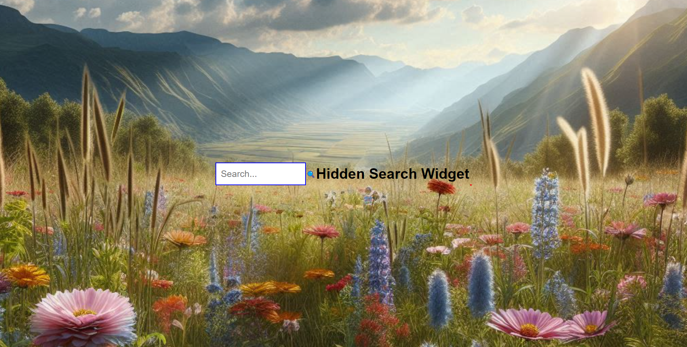

#Hidden Search Widget

##Overview

This project features a hidden search widget created with HTML, CSS, and JavaScript, designed to seamlessly blend into a full-background image. The widget provides a clean and modern interface, which expands when focused, making it a great addition to any website that requires a stylish search functionality without cluttering the visual space.

##Features

* Responsive Design: The widget is fully responsive, adapting to various screen sizes.
* Elegant Transition: The search input expands smoothly on focus, enhancing user experience.
* Background Image: A full-screen background image that serves as a visually appealing backdrop.
* Minimalist UI: The design focuses on simplicity, with clean lines and a modern look.

#Technologies Used
HTML: For structuring the widget.
CSS: For styling the widget and background.
JavaScript: To handle user interactions.

